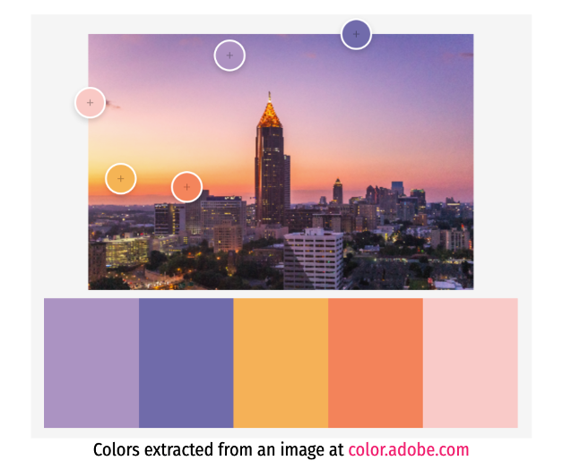
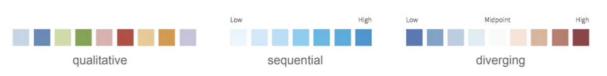

What do we need to consider when creating visualisations of our data?


1. Begin by defining the purpose of your visual(s), and its intended audience.


2. Choose appropriate form(s) for the intended purpose and function. **A LITTLE BIT OF THIS**


3. Consider how best to visualise the data using design principles (CRAP). **THIS WORKSHOP**


***
# Part 1: giving a CRAP with ggplot 
***


Goals of Part 1:


1. __ggplot__ - how building a `ggplot` works - step by step.


2. __CRAP & ggplot?__ - core graphical principles (CRAP - Contrast, Repition, Alignment and Proximity) that when applied to data in R can help visualise science in a meaningful (and beautiful) way!


```{r eval=T, echo=T, message = FALSE}

# Load libraries 
# if you need to install these run the code install.packages("package_name")

library(tidyverse)
library(ggthemes)
library(ggrepel) # for annotations 
library(viridis) # for color blind friendly colours 
library(RColorBrewer) 
library(reshape2)
library(ggsci)
library(patchwork)

```


***
### 1. __ggplot__ 
***


##### ggplot background


`ggplot2` is a graphing R package developed by Hadley Wickham that can be used to create professional looking plots for papers, reports or assignments. 

ggplot is part of the tidyverse and so can be used easily with other tidyverse packages like dplyr and tidyr. 

With ggplot, you can create a variety of plots inclusing, boxplots, scatterplots, histograms, bar graphs and maps. Many extension packages for ggplot also exist which can make it easy to reproduce specialised types of graphs (e.g. survival plots, geographic maps).


The gg in `ggplot2` stands for "The Grammar of Graphics" - this is book describing the graphics concept which describes plots by using a specified "grammar".  


##### ggplot basics


A plot can be divided into several fundamental components:

A ggplot can be thought of as building a plot through pulling together basic components. The most basic minimum components for any graph is 1. data 2. specified variables 3. the type of plot. Pretty much what data, which specific data where and how to plot. 

These components can be added in different ways, today we're going to focus on the most basic usage. 


1. __data__  a tidy data frame that holds the variables you would like to plot.

2. __aes__ aes specifies which variables to plot (i.e. your x and y variables). aes is where you state the visual properties that get mapped onto values in a data set (colour, size, shape etc.). This inclues specifying the variables to be plotted (x,y).

This code commonly causes confusion when creating ggplots. While aes stands for aesthetics, in ggplot it does not relate to the visual look of the graph but rather what data you want to see in the graph. It specifies what the graph presents rather than how it is presented. 

3. __geom__ corresponds to the type of plot you are trying to make (histogram, box plot, line plot, density plot, dot plot...).


There are two main functions for creating plots in the ggplot2 package: a `qplot()` and `ggplot()` function: 

+ `qplot()` quick plot function easy to use for simple plots
+ `ggplot()` more flexible function that allows you to build a plot piece by piece


##### Coding a ggplot


##### qplot for quick plot
```{r}
qplot(data = iris, x = Petal.Width)

qplot(data = iris, x = Petal.Width, y = Petal.Length)
```


##### ggplot
```{r}
data("iris")
str(iris)
#confirm the class of the variables

#component 1 data
ggplot(data = iris)

#component 2 variables
ggplot(iris, aes(x = Petal.Width, y = Petal.Length))

#component 3 variable
ggplot(data = iris, aes(x = Petal.Width, y = Petal.Length)) + geom_point()


```


Remember those open and closed brackets after geom_point(). Without those, nothing will happen


The type of graph you want to make has to match the classes of the inputs. For example, a scatterplot would require both variables to be numeric. Or a boxplot would require the x variable to be a factor and the y variable to be numeric. You can check the class of any variable with the class function, or all variables in a data frame with the str function.


```{r}

ggplot(iris, aes(Species, Petal.Width)) + geom_boxplot()

ggplot(iris, aes(Petal.Length, Petal.Width)) + geom_boxplot()

ggplot(iris, aes(Petal.Width)) + geom_boxplot()

```


##### Assign plots and print them


A helpful practise when making ggplots is to assign the plot you’ve made to an object (e.g., plot1 in the code above) and then ‘print’ it separately. As your ggplot becomes more complicated this will make it much easier.


Plots can be saved as a variable using <- assign, and printed at any time by calling the variable. 


```{r}
iris_petal_width_to_length_plot <- ggplot(data = iris, aes(x = Petal.Width, y = Petal.Length)) + geom_point()

iris_petal_width_to_length_plot + theme_bw() + labs(title = "Iris Petal Length to Width")


```


##### Other components: 


4. __theme__ a theme is a set of visual parameters that controls the background, borders, text, legend position etc. You can use predefined themes or create your own (see below!).


5. __stat__ a stat layer applies some kind of statistical transformation to the data. For example `stat_smooth(method = "lm")` displays a linear regression line with confidence intervals.


After creating a plot use `ggsave` to save a plot in the current working directory. 


save your plot
```{r}
pdf()

dev.off()
```


***
### 2. __CRAP & ggplot__ 
***


We can look to use some simple core graphical principles (CRAP - Contrast, Repition, Alignment and Proximity) that when applied to can help visualise data in a beautiful (and meaningful) way! The CRAP principles of design were developed by [Robin Williams](https://www.amazon.com.au/Non-Designers-Design-Book-Robin-Williams/dp/0133966151). Perfect for relative beginners in design, Robin developed four easy principles that when applied to data visualisation, can help communicate data in more effective ways. 


Some of these principles we can look to directly apply during graphics creation in R, whereas others can be applied during figure creation, or even during production of graphical abstracts. 


#### C - Contrast 


If two items are not exactly the same, make them different! Applying contrast can help attract attention to important elements, and groups of elements by making them stand out. 


_Fonts_


We can look to do this in plots by emphasising group difference with colour and size, in addition to using different font families, and font sizes for plot annotation. We will learn how to specify fonts and font sizes in ggplot theme() in section R - Repetition below. 


There are many fonts, and font weights (i.e. **bold**, *italic*, light) you can specify in R. Fonts have both short names and canonical names you can specify in R. 


```{r}

baseplot <- iris_petal_width_to_length_plot + theme_bw() + labs(title = "Iris Petal Length to Width")

baseplot

# Change all text in a figure to times new roman

baseplot + theme(text = element_text(family = "Times New Roman"))

# Change fonts for specific aspects of plot

baseplot +
  theme(plot.title    = element_text(family = "mono", face = "italic"),
        plot.subtitle = element_text(family = "sans"),
        axis.title.x  = element_text(family = "Comic Sans MS"),
        axis.title.y  = element_text(family = "AppleGothic"),
        axis.text.x   = element_text(family = "Optima"),
        axis.text.y   = element_text(family = "Luminari"))


```
```{r message = F, warning = FALSE}
fonttable <- read.table(header=TRUE, sep=",", stringsAsFactors=FALSE,
                        text='
Short,Canonical
mono,Courier
sans,Helvetica
serif,Times
,AvantGarde
,Bookman
,Helvetica-Narrow
,NewCenturySchoolbook
,Palatino
,URWGothic
,URWBookman
,NimbusMon
URWHelvetica,NimbusSan
,NimbusSanCond
,CenturySch
,URWPalladio
URWTimes,NimbusRom
')

fonttable$pos <- 1:nrow(fonttable)

fonttable <- melt(fonttable, id.vars="pos", measure.vars=c("Short","Canonical"),
                  variable.name="NameType", value.name="Font")

# Make a table of faces. Make sure factors are ordered correctly
facetable <- data.frame(Face = factor(c("plain","bold","italic","bold.italic"),
                                      levels = c("plain","bold","italic","bold.italic")))

fullfonts <- merge(fonttable, facetable)

pf <- ggplot(fullfonts, aes(x=NameType, y=pos)) + 
             geom_text(aes(label=Font, family=Font, fontface=Face)) +
             facet_wrap(~ Face, ncol=2)

pf
```


_Colour_


Colour is also a powerful tool and can be used to explain levels of data (e.g. through application of a gradient) in addition to simple, and more complex hierachical grouping structures. 

A online tools for choosing a palettes based on colour theory: 


+ [adobe colour](color.adobe.com)  


  
  
  

When we think about including colour in our graphics we need to make sure we think about useability and accessability; where we make sure that the palette (range of colours) we choose are not misleading, and are differentiated for those with varying colourblindness.

 


To help deal with problems associated with useability and accessability there are a number of really useful packages developed in R (in addition to a colour blind checker on adobe colour!). These include: 


  + Greys


  Sometimes absence of colour can be more powerful in communicating ideas. R has a number of built in grey palettes. 
  
  Usage in ggplot: 
      
        + scale_fill_grey() for box plot, bar plot, violin plot, dot plot etc.
        
        + scale_color_grey() for lines and points
        

+ RColorBrewer palettes
  
  
  The RColorBrewer package creates great palettes - that can also be filtered to be colourblind friendly.
  
  The package contains 3 sets of colour palette: sequential, qualitative and diverging. Understanding these groupings of colour can help in choosing how to include colour within your plots.
  
Tip: try and not go over 10 colours max for reliable differentiation

  
  1. Sequential - ordered data that progress from low to high.
  
  2. Qualitative - best suited for nominal or categorical data where colour does not imply magnitude between groups.
  
  3. Diverging - these put equal emphasis on mid-range and extreme values at both ends of the data range.
  
  
  
  
 
  Below are a few useful commands using RColorBrewer:
  
 
 
```{r}
# Display all colour palettes 
display.brewer.all()

# Display only colourblind friendly palettes
display.brewer.all(n = NULL, type = "all", select = NULL, # type = "div","qual","seq"
                   colorblindFriendly = TRUE)

#  Return the hexadecimal color specification 

# brewer.pal(n, name) # where n is the number of colours you want from the palette - minimum is 3!

# Display a single RColorBrewer palette 
# by specifying its name

# display.brewer.pal(n, name)

```
  Usage in ggplot
  
  
  
      + scale_fill_brewer() for box plot, bar plot, violin plot, dot plot etc.
      
      + scale_color_brewer() for lines and points


For those of you who are after a little more help - we can use ggsci(). ggsci offers a collection of color palettes inspired by scientific journals (as well as TV shows and science fiction!) 

https://cran.r-project.org/web/packages/ggsci/vignettes/ggsci.html


```{r}

# Nature publishing group
npg <- ggplot(iris, aes(Sepal.Length, Sepal.Width, colour = Species))+
  geom_point() +
  scale_color_npg() +
  theme_classic()
npg

# The simpsons
simpsons <- ggplot(iris, aes(Sepal.Length, Sepal.Width, colour = Species))+
  geom_point() +
  scale_color_simpsons() +
  theme_classic()
simpsons

```


_Size_


We can also change the size of the elements in a graph - which in itself can present data values or bring attention to one aspect of a plot. 


When a third variable is mapped to the size of points this is called a bubble chart.

```{r}

# Change size of all points
ggplot(iris, aes(Sepal.Length, Sepal.Width, colour = Species))+
  geom_point(size = 0.3) +
  scale_color_simpsons() +
  theme_classic()

# Change size of all points
bubble <- ggplot(iris, aes(Sepal.Length, Sepal.Width, colour = Species, size = Petal.Length))+
  geom_point(alpha = 0.5) +
  scale_size(name = "Petal length") +
  scale_color_simpsons() +
  theme_classic()

bubble

```


#### R - Repetition 


Repeat things in your design, throughout your design. This helps create a consistent look and feel, where recurring elements can help organise content and establish a sense of unity. 


How? There are a number of ways we can bring repetition into our designs in R, namely through the use of themes.  


Perfecting plots in ggplot can lead to a lot of lines starting with theme() quickly piling up. Doing this again for the next plot quickly leads to massive scripts with a lot of repetition. Instead, we suggest creating a customised theme for your manuscript/project that combines all of the elements in your theme that you want, and apply it to all of your plots for a project! You can add as many elements to your function as you want (as long as they do not contradict each other).


Below we provide an example of a function that makes a theme based off theme_bw(). This function takes no arguments, so is always coded as theme_name().


```{r}
my_plot_theme <- function(){
  theme_bw() +
    theme(text = element_text(family = "Helvetica Light"), # Insert your favourite font
          axis.text = element_text(size = 16), # Y and x axis font size
          axis.title = element_text(size = 18), # Axis title font size
          axis.line.x = element_line(color="black"), 
          axis.line.y = element_line(color="black"), 
          panel.border = element_blank(),
          panel.grid.major.x = element_blank(),  # panel.grid adds a blank border to your plot.       
          panel.grid.minor.x = element_blank(),
          panel.grid.minor.y = element_blank(),
          panel.grid.major.y = element_blank(),  
          plot.margin = unit(c(1, 1, 1, 1), units = , "cm"), # Adjust your plot margins (in cm)
          plot.title = element_text(size = 18, vjust = 1, hjust = 0), # Title font adjustments
          legend.text = element_text(size = 12),          
          legend.title = element_blank(),                              
          legend.position = c(0.95, 0.15), 
          legend.key = element_blank(),
          legend.background = element_rect(color = "black", 
                                           fill = "transparent", 
                                           size = 2, linetype = "blank")) # Sets the legend background to transparent
}

# Lets try out this theme with a basic plot 
# Feel free to play around with some of the specifications below. 

mytheme <- ggplot(iris, aes(Sepal.Length, Sepal.Width, colour = Species))+
  geom_point() +
  my_plot_theme()

mytheme

```

See [here](https://ggplot2-book.org/polishing.html) for further pointers on adjusting your own theme. 


Tip: If you do not want to create your own theme, there are a number of pre-specified themes built in to ggplot(). https://www.datanovia.com/en/blog/ggplot-themes-gallery/


#### A - Alignment & P - Proximity


Nothing should be placed randomly on a page. Make sure that every item has some visual connection with something else.  An important benefit here is that grouping graphics can organise information, and clarify concepts.


Tip: Try and group plots together from the same hypothesis group in your study, or plots that show results from the same method. 


In R we can look to align and group graphics we create using patchwork(). 


```{r}

# Place three plots vertically

baseplot + simpsons +  bubble + plot_layout(ncol =1)

# Change the relative heights of each plot

baseplot + simpsons +  bubble + plot_layout(ncol =1, heights = c(2,1,1))

# Use nested layouts 

bubble +{
  mytheme + {
 {
   simpsons +
      baseplot +
      plot_layout(ncol=1)
  }
}
}+
  plot_layout(ncol=1)

```


OR for more intuitive layouts we can use / operator (next to) and | (below)


```{r}

(baseplot|simpsons)/(bubble|mytheme)


(baseplot/simpsons/mytheme)|(bubble)

```
https://gotellilab.github.io/GotelliLabMeetingHacks/NickGotelli/ggplotPatchwork.html 


