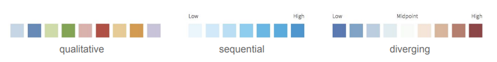
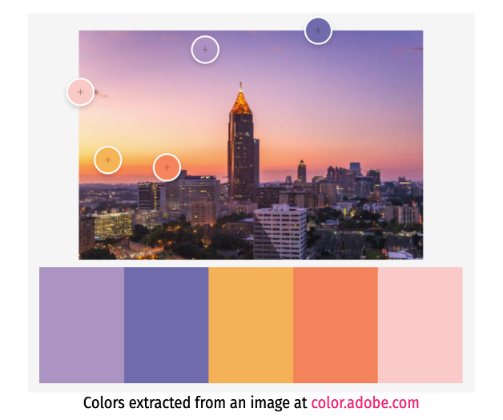

***

***

***

**What do we need to consider when creating visualisations of our data?**


1. Begin by defining the purpose of your visual(s), and its intended audience.


2. Choose appropriate form(s) for the intended purpose and function. *A LITTLE BIT OF THIS*


3. Consider how best to visualise the data using design principles (CRAP). *THIS WORKSHOP*


***
# Part 1: basics of ggplot 
***


Aims of Part 1:


1. __ggplot__ - how building a `ggplot` works step by step.


2. __CRAP & ggplot?__ - core graphical principles (CRAP - Contrast, Repetition, Alignment and Proximity) that when applied to data in R can help visualise data in a meaningful (and beautiful) way!


***
### 1. __ggplot2__ 
***


##### ggplot background


`ggplot2` is a graphing R package developed by Hadley Wickham that can be used to create professional looking plots for papers, reports or assignments. 

The gg in `ggplot2` stands for "The Grammar of Graphics" - this is book describing the graphics concept which describes plots by using a specified "grammar".  

`ggplot2` is part of the tidyverse and so can be used easily with other tidyverse packages like dplyr and tidyr. 

With `ggplot2`, you can create a variety of plots including, boxplots, scatterplots, histograms, bar graphs and maps. Many extension packages for `ggplot2` also exist which can make it easy to reproduce specialised types of graphs (e.g. survival plots, geographic maps).

***


***


##### ggplot basics

A ggplot can be thought of as building a plot through pulling together basic components. The most basic minimum components for any graph is the data, specified variables and the type of plot.

These components can be added in different ways to create the desired plot output. You could add multiple components of one type to the plot or add every different type of component - whatever you need to communicate your story best.


Today we're going to focus the basic building blocks and show some examples of how it can look once you pull a number of components together. 

The fundamental components in ggplot language:

__1. data__  a tidy data frame that holds the variables you would like to plot.

__2. aes__ aes specifies which variables to plot (i.e. your x and y variables). aes is where you state the visual properties that get mapped onto values in a data set (colour, size, shape etc.). This inclues specifying the variables to be plotted (x,y). aes can cause confusion when creating ggplots. While aes stands for aesthetics, in ggplot it does not relate to the visual look of the graph but rather what data you want to see in the graph. It specifies what the graph presents rather than how it is presented. 

__3. geom__ corresponds to the type of plot you are trying to make (histogram, box plot, line plot, density plot, dot plot...).

***


Start by loading your libraries:

```{r eval=T, echo=T, message = FALSE}

# Load libraries 
# if you need to install these run the code install.packages("package_name")

library(tidyverse) #includes ggplot2
#library(ggplot2)
library(ggrepel) # for annotations 
library(viridis) # for color blind friendly colours 
library(RColorBrewer) # gives nice colour palettes for different types of data i.e. continuous vs discrete
library(ggsci) # interesting set of colour palettes
library(patchwork) # for placing plots next to each other

```


***

##### Coding a ggplot

There are two main functions for creating plots in the ggplot2 package: a `qplot()` and `ggplot()` function: 

+ `qplot()` quick plot function easy to use for simple plots
+ `ggplot()` more flexible function that allows you to build a plot piece by piece


##### check data first

Today we'll be using the 'iris' data which is freely available and can be accesssed directly from R.

```{r}
data("iris")
```

Before you plot your data, it's always a good idea to look at the type of data you have. 

Is your data continuous? Is it categorical? 

Sometimes when you read your data into R, it may suprise you that what you thought would be numerical has been read in as categorical. This can cause problems when you're trying to plot so its always worth checking beforehand and changing the class of your variables. 
```{r}
#confirm the class of the variables
str(iris)
```
In iris, we have 4 numerical variables and 1 factoral variable. These are the expected types for what we want to plot so we can proceed.


##### qplot for quick plot
A 'quick' plot is for when you're just wanting to plot something to get an idea of the shape of the data. For example, I may use a qplot when I'm wanting to check if my data is normally distributed (or not).

```{r}
qplot(data = iris, x = Petal.Width)

qplot(data = iris, x = Petal.Width, y = Petal.Length)
```


##### ggplot for when you're wanting to be intentional with plotting
```{r}
#component 1 data
ggplot(data = iris)

#component 2 variables
ggplot(iris, aes(x = Petal.Width, y = Petal.Length))

#component 3 variable
ggplot(data = iris, aes(x = Petal.Width, y = Petal.Length)) + geom_histogram()


```

other plots
```{r}
ggplot(iris, aes(Petal.Width)) +geom_histogram()

ggplot(iris, aes(Petal.Width, Species)) +geom_boxplot()

```
 

Remember those open and closed brackets after geom_point(). Without those, nothing will happen.

***

The type of graph you want to make has to match the classes of the inputs. You can check the class of any variable with the class function, or all variables in a data frame with the str function.


##### aes options
aes defines the x and y variable of a plot. It also can define other variables within the plot including how you want to group variables.

Other key aes options include fill and colour.

Colour is used to define a variable you want to group together and distinguish through colour in the plot. 


```{r}

ggplot(data = iris, aes(x = Petal.Width, y = Petal.Length, colour = Species)) + geom_point()

ggplot(data = iris, aes(x = Petal.Width, colour = Species)) + geom_histogram()

ggplot(data = iris, aes(x = Petal.Width, fill = Species)) + geom_histogram()

```


##### Assign plots and print them


A helpful practice when making ggplots is to assign the plot you’ve made to an object (e.g., plot1 in the code above) and then ‘print’ it separately. As your ggplot becomes more complicated this will make it much easier.


Plots can be saved as a variable using <- assign, and printed at any time by calling the variable. 
```{r}
iris_petal_width_to_length_plot <- ggplot(data = iris, aes(x = Petal.Width, y = Petal.Length, colour = Species)) + geom_point()

iris_petal_width_to_length_plot


```


##### Other key components: 


__4. theme__ a theme is a set of visual parameters that controls the background, borders, text, legend position etc. You can use predefined themes or create your own (see below!).


```{r}

iris_petal_width_to_length_plot + theme_bw()

```


```{r}
mytheme3 <- theme(legend.text = element_text(face = "italic",colour="gray20",
                                            family = "Helvetica", size = rel(1)), 
                 axis.title = element_text(colour="gray20",family = "Helvetica",
                                           size = rel(1.2)), 
                 axis.text = element_text(family = "Helvetica",colour = "gray61",
                                          size = rel(1.2)), 
                 axis.line = element_blank(),
                 axis.ticks = element_line(colour="grey",size = rel(0.8)),
                 panel.grid.major = element_line(colour="grey",size = rel(0.5)), 
                 panel.grid.minor = element_blank(), 
                 panel.background = element_rect(fill = "whitesmoke"), 
                 legend.key = element_rect(fill = "whitesmoke"), 
                 legend.title = element_text(colour = "gray20",size = rel(1.2),
                                             family = "Helvetica"), 
                 plot.title = element_text(colour = "gray20", face = "bold",
                                           size = rel(1.8),family = "Helvetica"))


```


add theme to plot
```{r}
iris_petal_width_to_length_plot + mytheme3
```


__5. stat__ a stat layer applies some kind of statistical transformation to the data. For example `stat_smooth(method = "lm")` displays a linear regression line with confidence intervals.


```{r}

iris_petal_width_to_length_plot + mytheme3 + stat_smooth(method = "lm")

```


__6. labs__ stands for labels. You can add labels like title, x axis, y axis.

```{r}
iris_petal_width_to_length_plot + mytheme3 + stat_smooth(method = "lm") + labs(title = "Iris Petal Width compared to length", x = "Petal Width (cm)", y = "Petal Length (cm)")

```


After creating a plot use `ggsave` to save a plot in the current working directory. 

Alternatively you could use the pdf function. 


save your plot
```{r}
dir.create("plots/")

pdf("plots/iris_petal_width_to_length_plot.pdf")
iris_petal_width_to_length_plot + mytheme3 + stat_smooth(method = "lm")
dev.off()
```

Alternatively
```{r}
ggsave("plots/my_iris_plot2.png")
```


***
### 2. __CRAP & ggplot__ 
***

Now that we have an idea of how to use ggplot, we can now learn about some simple core graphical principles (CRAP - Contrast, Repition, Alignment and Proximity) that when applied to our plotting can help visualise data in a beautiful (and meaningful) way! The CRAP principles of design were developed by designer [Robin Williams](https://www.amazon.com.au/Non-Designers-Design-Book-Robin-Williams/dp/0133966151).
for non-designers!

Perfect for relative beginners in design these four easy principles that when applied can help unify projects through clarifying concepts and relationships between elements, enhancing design and ultimately communicate data in more effective ways. 


Some of these principles we can look to directly apply during graphics creation in R, whereas others can be applied during figure creation, or even during production of graphical abstracts. 


As with many things in R - there are multiple ways you can achieve these things in ggplot(). Here we specify some options for you to explore with your own data visualisations!


#### C - Contrast 


If two items are not exactly the same, make them different! Applying contrast can help attract attention to important elements, and groups of elements by making them stand out. 


We can look to do this in plots by emphasising group difference with colour and size, in addition to using different font families, and font sizes for plot annotation. 


_Fonts_


There are many fonts, and font weights (i.e. **bold**, *italic*, light) you can specify in R. Fonts have both short names and canonical names - you can specify either.


Why change fonts to add contrast? Different fonts, and font families can be specific for different groups of text on a design (i.e a heading vs a subtitle, or axis text vs text within a plot). This can aid in visually differentiating text elements in a figure.


If you want to go all out on using custom fonts - we suggest looking into [extrafont](https://cran.r-project.org/web/packages/extrafont/index.html) and [showtext](https://cran.r-project.org/web/packages/showtext/index.html) packages. 


How can we change fonts in ggplot? The easiest way to do this is through editing the theme() and use element_text to change the family and face of font. You can do this for the whole plot, or for specific elements of the plot. (Note for text options on plots you can also use geom_text()!)


```{r}

# First lets make a basic plot 
baseplot <- iris_petal_width_to_length_plot + theme_bw() + labs(title = "Iris Petal Length to Width")

baseplot

# Change all text in a figure to times new roman

baseplot + 
  theme(text = element_text(family = "Times New Roman", face = "bold"))

# Change fonts for specific aspects of plot

baseplot +
  theme(plot.title    = element_text(family = "mono", face = "italic"),
        plot.subtitle = element_text(family = "sans"),
        axis.title.x  = element_text(family = "Comic Sans MS"),
        axis.title.y  = element_text(family = "AppleGothic"),
        axis.text.x   = element_text(family = "Optima"),
        axis.text.y   = element_text(family = "Luminari"))

```

Lets have a look at some of the font options that are available without having to play around with other packages! 


The table generated below shows you some of these font types available to you in R - this might throw up some warnings, the advice here is that the basic fonts (at the bottom) of the table work - others can be a little more tricky.

```{r message = F, warning = FALSE}
fonttable <- read.table(header=TRUE, sep=",", stringsAsFactors=FALSE,
                        text='
Short,Canonical
mono,Courier
sans,Helvetica
serif,Times
,AvantGarde
,Bookman
,Helvetica-Narrow
,NewCenturySchoolbook
,Palatino
,URWGothic
,URWBookman
,NimbusMon
URWHelvetica,NimbusSan
,NimbusSanCond
,CenturySch
,URWPalladio
URWTimes,NimbusRom
')

fonttable$pos <- 1:nrow(fonttable)

fonttable <- melt(fonttable, id.vars="pos", measure.vars=c("Short","Canonical"),
                  variable.name="NameType", value.name="Font")

# Make a table of faces. Make sure factors are ordered correctly
facetable <- data.frame(Face = factor(c("plain","bold","italic","bold.italic"),
                                      levels = c("plain","bold","italic","bold.italic")))

fullfonts <- merge(fonttable, facetable)

pf <- ggplot(fullfonts, aes(x=NameType, y=pos)) + 
             geom_text(aes(label=Font, family=Font, fontface=Face)) +
             facet_wrap(~ Face, ncol=2)

pf
```


_Colour_


We all want to use colour in our plots and it is no surprise that it can be key to producing clear and beautiful graphics. 

Colour is also a powerful tool that can be used to explain levels of data in addition to simple, and more complex hierachical grouping structures. 

So how do we go about choosing colour(s) for our visualisations?


There are a number of things we need to consider: 


* Data types,structure and aim: colour choice will be inherently related to your graphics and the type of plot you are creating. For example, would you like colour to help differentiate between groupings (for example different levels of a treatment), or would you like colour to convey data itself through use of a gradient? 

* Useability and accessibility: When we think about including colour in our graphics we need to make sure we think about useability and accessability; where we make sure that the palette (range of colours) we choose are not misleading, and are differentiated for those with varying colourblindness.


Data types and structure can inform the type of palette we might look to use:


  1. Sequential - ordered data that progress from low to high.
  
  
  2. Qualitative - best suited for nominal or categorical data where colour does not imply magnitude between groups.
  
  
  3. Diverging - these put equal emphasis on mid-range and extreme values at both ends of the data range.
  
  
  


Tip: try and not go over 10 colours max for reliable differentiation. If you need more than 10 colours, try changing the hue, opacicity and lightness of pairs of colours.


There are several ways (and endless online material) that can help you choose and specify colour in ggplot. 

One of my favourites is an online tool for choosing a palettes based on colour theory: 

+ [adobe colour](color.adobe.com)  This is limited to choosing 5 colours as of now - there are other options online for palettes with more colours!

  
  
Using color.adobe you can extract the hex.codes for your colors of choice and manually assign them in ggplot. 

        + scale_fill_manual() for box plot, bar plot, violin plot, dot plot etc.
        
        + scale_color_manual() for lines and points

```{r}
group.colors <- c("#EBD44F","#E823A8","#229E84")

# Remember to specify what you want grouping you want the points coloured by in aes() 

ggplot(iris, aes(Sepal.Length, Sepal.Width, colour = Species))+
  geom_point() +
  theme_bw() +
  labs(title = "Iris Petal Length to Width") + 
  theme(text = element_text(family = "Times New Roman")) +
  scale_color_manual(values = group.colors)
  
```

To help deal with problems associated with useability and accessability there are a number of other really useful packages developed in R (in addition to a colour blind checker on adobe colour!). These include: 

  + Greys

  Sometimes absence of colour can be more powerful in communicating ideas. R has a number of built in grey palettes. 
  
  Usage in ggplot: 
      
          + scale_fill_grey() for box plot, bar plot, violin plot, dot plot etc.
        
          + scale_color_grey() for lines and points
        
+ RColorBrewer palettes
  
  The RColorBrewer package great palettes that can also be filtered to be colourblind friendly.The package contains 3 sets of colour palette: sequential, qualitative and diverging. 
  
  Usage in ggplot: 
    
          + scale_fill_brewer() for box plot, bar plot, violin plot, dot plot etc.
      
          + scale_color_brewer() for lines and points

  Below are a few useful commands using RColorBrewer:
  
```{r}
# Display all colour palettes 
display.brewer.all()

# Display only colourblind friendly palettes
display.brewer.all(n = NULL, type = "all", select = NULL, # type = "div","qual","seq"
                   colorblindFriendly = TRUE)


# Display a single RColorBrewer palette 
# by specifying its name

display.brewer.pal(n = 10, "Paired")

#  Return the hexadecimal color specification 

brewer.pal(n = 10, "Paired") # where n is the number of colours you want from the palette - minimum is 3!


```
  
  
For those of you who are after a little more help in choosing colours - we can use ggsci(). ggsci offers a collection of color palettes inspired by scientific journals (as well as TV shows and science fiction!) 

https://cran.r-project.org/web/packages/ggsci/vignettes/ggsci.html


```{r}

# Nature publishing group
npg <- ggplot(iris, aes(Sepal.Length, Sepal.Width, colour = Species))+
  geom_point() +
  scale_color_npg() +
  theme_classic()
npg

# The simpsons
simpsons <- ggplot(iris, aes(Sepal.Length, Sepal.Width, colour = Species))+
  geom_point() +
  scale_color_simpsons() +
  theme_classic()
simpsons

```
_Size_

We can also change the size of the elements in a graph which in itself can present data values or bring attention to one aspect of a plot. 

Size can also be used to represent data values. When a third variable is mapped to the size of points this is called a bubble chart. 


```{r}

# Change size of all points
ggplot(iris, aes(Sepal.Length, Sepal.Width, colour = Species))+
  geom_point(size = 0.3) +
  scale_color_simpsons() +
  theme_classic()

# Change size of all points based on third variable - petal.length

bubble <- ggplot(iris, aes(Sepal.Length, Sepal.Width, colour = Species, size = Petal.Length))+
  geom_point(alpha = 0.5) +
  scale_size(name = "Petal length") +
  scale_color_simpsons() +
  theme_classic()

bubble

```


#### R - Repetition 


Repeat things in your design, throughout your design. This helps create a consistent look and feel, where recurring elements can help organise content and establish a sense of unity. 


How? There are a number of ways we can bring repetition into our designs in R, namely through the use of themes.


Perfecting plots in ggplot can lead to a lot of lines starting with theme() quickly piling up. Doing this again for the next plot quickly leads to massive scripts with a lot of repetition. Instead, we suggest creating a customised theme for your manuscript/project that combines all of the elements in your theme that you want, and apply it to all of your plots for a project! 


There are multiple ways to make your own themes and specify them in ggplots. Earlier Fiona demonstrated how this can be done through assigning a theme to an object.


Below we provide an example of a function that makes a theme based off theme_bw(). This function takes no arguments, so is always coded as theme_name().You can add as many elements to your function as you want (as long as they do not contradict each other). Don't worry - this is probably one of the easiest themes you will ever write, and it allows you to build off pre-existing themes (so half the work is already done!).


```{r}
my_plot_theme <- function(){
  theme_bw() +
    theme(text = element_text(family = "Helvetica Light"), # Insert your favourite font
          axis.text = element_text(size = 16), # Y and x axis font size
          axis.title = element_text(size = 18), # Axis title font size
          axis.line.x = element_line(color="black"), 
          axis.line.y = element_line(color="black"), 
          panel.border = element_blank(),
          panel.grid.major.x = element_blank(),  # panel.grid adds a blank border to your plot.       
          panel.grid.minor.x = element_blank(),
          panel.grid.minor.y = element_blank(),
          panel.grid.major.y = element_blank(),  
          plot.margin = unit(c(1, 1, 1, 1), units = , "cm"), # Adjust your plot margins (in cm)
          plot.title = element_text(size = 18, vjust = 1, hjust = 0), # Title font adjustments
          legend.text = element_text(size = 12),          
          legend.title = element_blank(),                              
          legend.position = c(0.95, 0.15), 
          legend.key = element_blank(),
          legend.background = element_rect(color = "black", 
                                           fill = "transparent", 
                                           size = 2, linetype = "blank")) # Sets the legend background to transparent
}

# Lets try out this theme with a basic plot 
# Feel free to play around with some of the specifications below. 

mytheme <- ggplot(iris, aes(Sepal.Length, Sepal.Width, colour = Species))+
  geom_point() +
  my_plot_theme()

mytheme

```

See [here](https://ggplot2-book.org/polishing.html) for further pointers on adjusting your own theme. 


AND of course, if you do not want to create your own theme, there are a number of pre-specified themes built in to ggplot(). https://www.datanovia.com/en/blog/ggplot-themes-gallery/


#### A - Alignment & P - Proximity


Nothing should be placed randomly on a page. Make sure that every item has some visual connection with something else.  An important benefit here is that grouping graphics can organise information, and clarify concepts.


Tip: Try and group plots together from the same hypothesis group in your study, or plots that show results from the same method. 


In R we can look to align and group graphics we create using patchwork() or facet_wrap(). 


```{r}

# Place three plots vertically

baseplot + simpsons +  bubble + plot_layout(ncol =1)

# Change the relative heights of each plot

baseplot + simpsons +  bubble + plot_layout(ncol =1, heights = c(2,1,1))

# Use nested layouts 

bubble +{
  mytheme + {
 {
   simpsons +
      baseplot +
      plot_layout(ncol=1)
  }
}
}+
  plot_layout(ncol=1)


ggplot(iris, aes(Sepal.Width, Sepal.Length)) + geom_point() +
  facet_wrap(~Species)


```

OR for more intuitive layouts we can use / operator (next to) and | (below)


```{r}

(baseplot|simpsons)/(bubble|mytheme)


(baseplot/simpsons/mytheme)|(bubble)

```


For more information on options have a look here:  https://gotellilab.github.io/GotelliLabMeetingHacks/NickGotelli/ggplotPatchwork.html 


