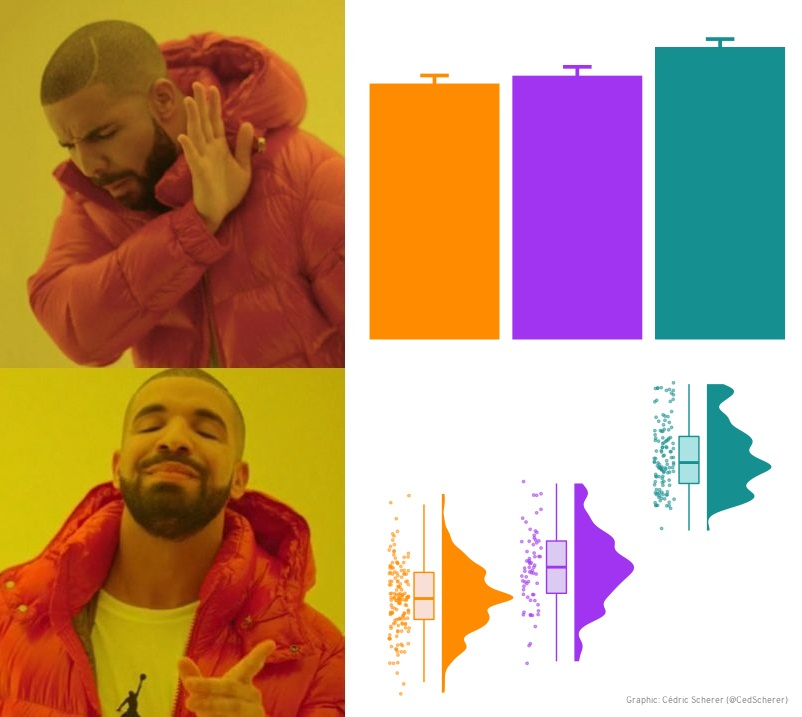

Today we are going to focus on how we can move plots along from a quick exploration of data - to a plot that clearly presents your data and illustrates your findings. We will do this by working through an example where we will make a plot type called a raincloud plot.


Goals of Part 2: 


1. Evolve a plot from basic visualisation to a raincloud plot!

2. Create our own plot using ggplot and CRAP principles


(Note: We will be manipulating the data using functions from tidyverse - including pipes (%>%). These are great for streamlining code. You can find an introduction to using them here https://r4ds.had.co.nz/pipes.html.)


```{r}

# Libraries 

# if you need to install these run the code install.packages("package_name")
library(tidyverse)
library(ggthemes)
library(ggrepel) # for annotations 
library(viridis) # for color blind friendly colours 
library(ggdist) # for half violin plots
library(patchwork) # for pasting plots together

```


References for part 2: 


* [Twitter thread link](https://twitter.com/CedScherer/status/1375438100298674179?ref_src=twsrc%5Etfw%7Ctwcamp%5Etweetembed%7Ctwterm%5E1375438100298674179%7Ctwgr%5E%7Ctwcon%5Es1_&ref_url=https%3A%2F%2Fwww.cedricscherer.com%2F2021%2F06%2F06%2Fvisualizing-distributions-with-raincloud-plots-with-ggplot2%2F)


* [ggplot tutorial by Cedrich Scherer](https://www.cedricscherer.com/2021/06/06/visualizing-distributions-with-raincloud-plots-and-how-to-create-them-with-ggplot2/)


* [Our coding club raincloud tutorial](https://ourcodingclub.github.io/tutorials/dataviz-beautification)


* [Allen et al., 2021](https://wellcomeopenresearch.org/articles/4-63)
(Note: they have developed a package called 'raincloud plot'- however this is not yet on CRAN, it also wraps ggplot functionality into one function, instead of geoms. This means you can't edit each layer separately.)


### Worked example: Visualising distributions (and make them rain data with raincloud plots)

> Behind every mean there is a distribution, and that distribution has a story to tell.

https://ourcodingclub.github.io/tutorials/dataviz-beautification


***


A rain cloud plot is a hybrid plot that brings together three plot types. They were first presented in [2019](https://twitter.com/micahgallen/status/1112780615198429185?lang=en
https://wellcomeopenresearch.org/articles/4-63/v1) and have since received a lot of attention on social media :



[Twitter thread link](https://twitter.com/CedScherer/status/1375438100298674179?ref_src=twsrc%5Etfw%7Ctwcamp%5Etweetembed%7Ctwterm%5E1375438100298674179%7Ctwgr%5E%7Ctwcon%5Es1_&ref_url=https%3A%2F%2Fwww.cedricscherer.com%2F2021%2F06%2F06%2Fvisualizing-distributions-with-raincloud-plots-with-ggplot2%2F)


A raincloud plot is three plot types in one: 


1. __Box plot__

2. __Density plot__ (histogram)

3. __Scatter plot__


Developed to overcome issues associated with masking distributions of data when plotting columns with error-bars. Rain cloud plots allow visualisation of the raw data, distribution of the data as density and key summary statistics all at the same time. 


__Data__ 


The data we will be visualising is publicly available from the LTER Data Portal https://portal.lternet.edu/nis/home.jsp and comprise of plant observations from an experiment at Niwot Ridge LTER.

This dataset is from a fertilisation experiment at Niwot Ridge LTER site. There are multiple plots per fertiliser treatment, and species occurrence in each plot was monitored over several years. 

In this workshop we are going to produce a rain cloud plot that compare species richness among fertiliser treatments over time.


a. Loading the data 
```{r}
# Load data - plant records from the Long Term Ecological Research # Network 
# Niwot Ridge site

niwot_plant_exp <- read.csv("niwot_plant_exp.csv")
```


b.  First of all we need to calculate species richness: 
```{r}
# Calculate species richness per plot per year

niwot_richness <- niwot_plant_exp %>% group_by(plot_num, year) %>%
  mutate(richness = length(unique(USDA_Scientific_Name))) %>% ungroup()

```


c. Now we can visualise how species richness varies across fertilisation treatments.
```{r}

head(niwot_richness)

distributions1 <- ggplot(niwot_richness, aes(x = fert, y = richness)) +
    geom_violin()

distributions1

```

d. A useful first look at the data distributions! Can we bring in some colour, and add our theme so that the plot is more clear.


First specify the theme for your plot.
```{r}
my_plot_theme <- function(){
  theme_bw() +
    theme(text = element_text(family = "Helvetica Light"), # Insert your favourite font
          axis.text = element_text(size = 16), # Y and x axis font size
          axis.title = element_text(size = 18), # Axis title font size
          axis.line.x = element_line(color="black"), 
          axis.line.y = element_line(color="black"), 
          panel.border = element_blank(),
          panel.grid.major.x = element_blank(),  # panel.grid adds a blank border to your plot.       
          panel.grid.minor.x = element_blank(),
          panel.grid.minor.y = element_blank(),
          panel.grid.major.y = element_blank(),  
          plot.margin = unit(c(1, 1, 1, 1), units = , "cm"), # Adjust your plot margins (in cm)
          plot.title = element_text(size = 18, vjust = 1, hjust = 0), # Title font adjustments
          legend.text = element_text(size = 12),          
          legend.title = element_blank(),                              
          legend.position = c(0.95, 0.15), 
          legend.key = element_blank(),
          legend.background = element_rect(color = "black", 
                                           fill = "transparent", 
                                           size = 2, linetype = "blank")) # Sets the legend background to transparent
}

# Lets try out this theme with a basic plot 
# Feel free to play around with some of the specifications below. 

ggplot(iris, aes(Sepal.Length, Sepal.Width, colour = Species))+
  geom_point() +
  my_plot_theme()

```

```{r}
distributions2 <- ggplot(niwot_richness, aes(x = fert, y = richness)) +
    geom_violin(aes(fill = fert, colour = fert), alpha = 0.5) +   # alpha controls the opacity
    scale_fill_viridis_d() + # Colour blind friendly palette
    my_plot_theme() 

distributions2
```


e. How about some summary statistics so we can begin to investigate differences between groups?


```{r}
# Overlay violins with box plots 

distributions3 <- ggplot(niwot_richness, aes(x = fert, y = richness)) +
    geom_violin(aes(fill = fert, colour = fert), alpha = 0.5) +
    geom_boxplot(aes(colour = fert), width = 0.2) +
    scale_fill_viridis_d() + # Colour blind friendly palette
    my_plot_theme() 

distributions3

```


f. Better still, we can add the raw data points to this plot. Adding raw points to the plot we just created could lead to a very messy plot...instead we can apply a number of changes to this plot that allow for clear visualisation of the boxplot, distribution and raw data side by side. 
Note: make sure you have ggdist() loaded to add half violin plot. 

```{r}

distributions5 <- ggplot(niwot_richness, aes(x = fert, y = richness, fill = fert)) +
ggdist::stat_halfeye(
    adjust = .5, # Custom width
    width = .6, 
    .width = 0, # Remove slab interval
    justification = -.4, # Move geom to the right
    point_colour = NA,# Removes slab interval
    alpha = 0.8
  ) + 
  geom_boxplot(
    width = .15, # Custom width
    outlier.shape = NA,
    alpha = 0.8) + # Adjust opacity
  geom_point(aes(y = richness, color = fert),
    ## draw horizontal lines instead of points
    size = 1.3,
    alpha = .1, # Opaque points
    position = position_jitter(
      seed = 1, width = .1
    )) +
    # coord_cartesian(xlim = c(1.2, NA), clip = "off") + 
      # \n adds a new line which creates some space between the axis and axis title
    labs(y = "Species richness\n", x = NULL) +
    # Removing legends
    #guides(fill = FALSE, color = FALSE) +
    # Setting the limits of the y axis
    scale_y_continuous(limits = c(0, 30)) +
    # Picking nicer colours
    scale_fill_manual(values = c("#5A4A6F", "#E47250",  "#EBB261", "#9D5A6C")) + # Specify     colours using hex codes.
    scale_colour_manual(values = c("#5A4A6F", "#E47250",  "#EBB261", "#9D5A6C")) + # Specify     colours using hex codes.
  my_plot_theme()

distributions5


```


g. Finally, for a full rain cloud plot, we can flip the axis. 


```{r}

distributions6 <- distributions5 + coord_flip()

distributions6

# Save this plot as a png. 

ggsave(distributions6, filename = "distributions6.png", height = 5, width = 5)

```


h. We now welcome you to have a play around with this data set, see whether you can group treatments and present this data using some of what you have learned today!


```{r eval=F, echo=T}

# Create new columns based on a combo of conditions using case_when()
# A fictional example

data_play <- niwot_richness %>% mutate(fairy_dust = case_when(fert == "PP" | fert == "NP" |
                                                                   fert == "NN" ~ "Fertiliser", fert == "CC" ~ "Control"))

distributions_magic <- 
    ggplot(data = data_play, 
           aes(x = reorder(fairy_dust, desc(richness)), y = richness, fill = fairy_dust)) +
  ggdist::stat_halfeye(
    adjust = .5, 
    width = .6, 
    .width = 0, 
    justification = -.4, 
    point_colour = NA,
    alpha = 0.8
  ) + 
    geom_point(aes(y = richness, color = fairy_dust), 
               position = position_jitter(width = 0.15), size = 1, alpha = 0.1) +
    geom_boxplot(width = 0.2, outlier.shape = NA, alpha = 0.8) +
    labs(y = "\nSpecies richness", x = NULL) +
    scale_y_continuous(limits = c(0, 30)) +
    scale_fill_manual(values = c("turquoise4", "magenta4")) +
    scale_colour_manual(values = c("turquoise4", "magenta4")) +
    coord_flip() +
    my_plot_theme()

distributions_magic

```


